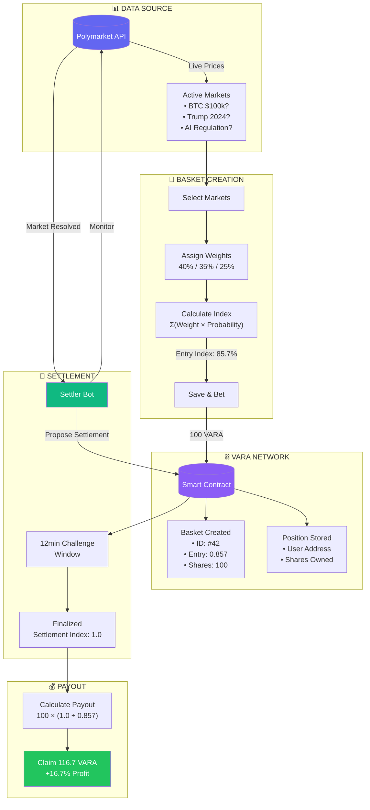
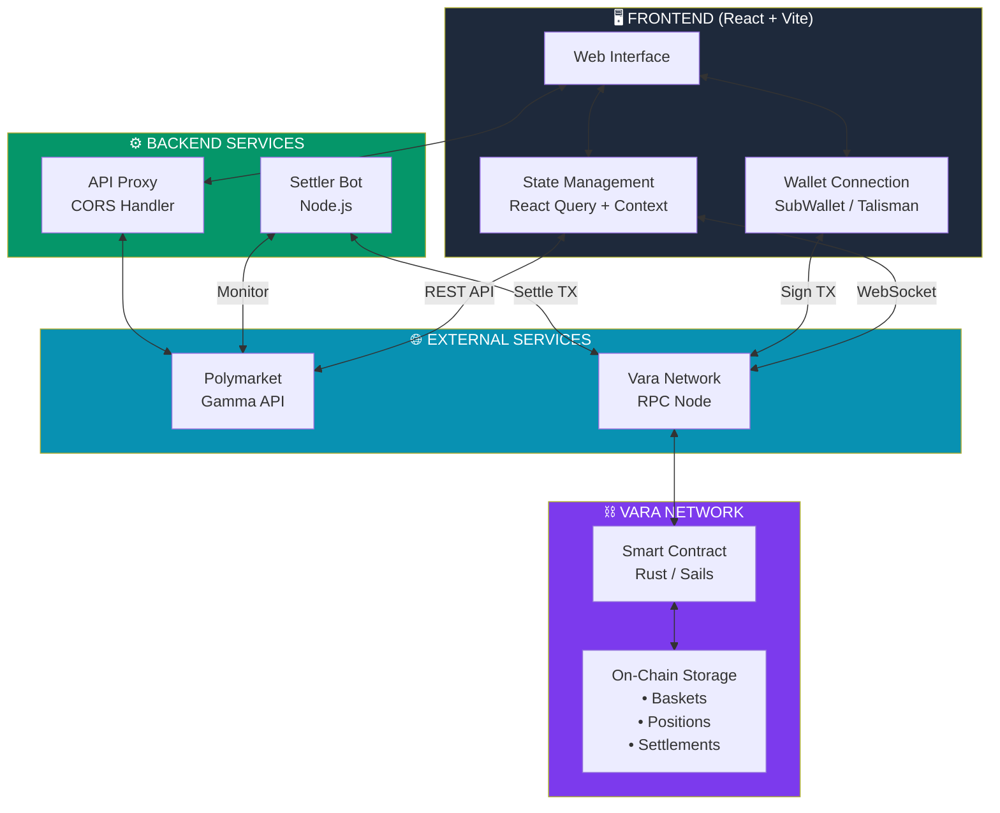
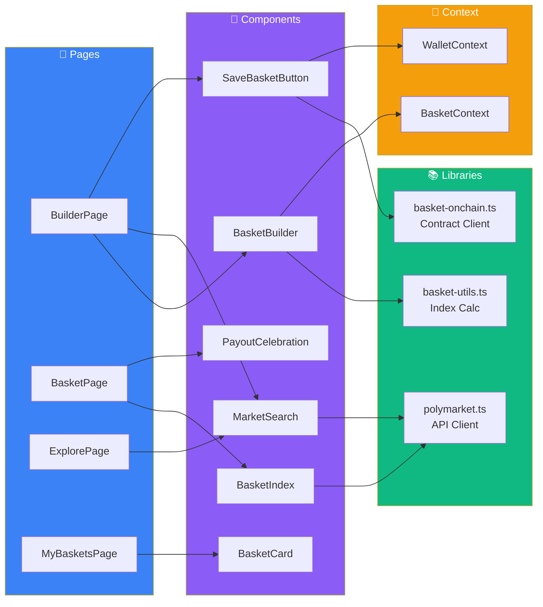
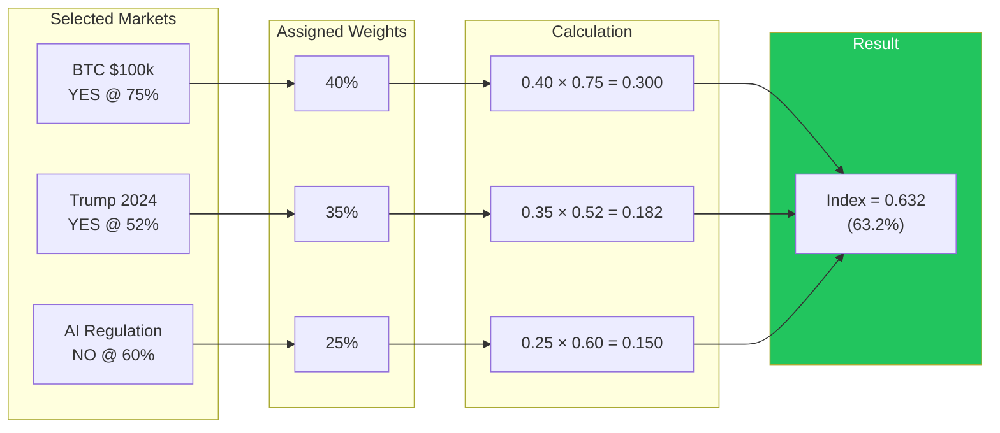

# 🧺 PolyBaskets

**ETF for prediction markets - A prediction market aggregator that lets you bundle multiple Polymarket outcomes into one basket, set custom weights and bet as a single position — a portfolio in one trade**

[](https://polybaskets-production.up.railway.app/)
[](https://vara.network)

---

## 🎯 The Problem

**Prediction markets are fragmented and limited:**

- Users can only bet on **individual markets** one at a time
- No way to create **diversified positions** across multiple outcomes
- Managing multiple bets is **complex and time-consuming**
- No mechanism to bet on **correlated events** as a single position
- Missing the concept of **index-based investing** in predictions

**Example:** You believe tech stocks will boom, AI regulation will pass, and crypto will rally. Currently, you'd need to place 3+ separate bets, track each one, and manage payouts individually.

---

## 💡 The Solution

**PolyBaskets** lets you create **prediction market baskets** - curated collections of Polymarket outcomes with custom weights, all settled as a single on-chain position.

---

## 🔄 How It Works



---

## 🏗️ System Architecture



## 🚀 Deployment Summary

Daily contest runtime now uses one unified root deployment contract.

Use only:

- [`docker-compose.yml`](polybaskets/docker-compose.yml)
- [`.env.example`](polybaskets/.env.example)
- [`.env.secrets.example`](polybaskets/.env.secrets.example)

Stack services:

- `postgres`
- `indexer-migrate`
- `indexer-processor`
- `indexer-api`
- `bet-quote-service`
- `contest-bot`
- `settler-bot`

Quick start:

```bash
cp .env.example .env
cp .env.secrets.example .env.secrets
```

Fill:

- chain/program env in `.env`
- include `BET_TOKEN_PROGRAM_ID` so the indexer can count `Approve` and `BetToken Claim` activity for the daily leaderboard
- exactly one of `SETTLER_SEED` or `SETTLER_SEED_FILE` in `.env.secrets`
- exactly one of `BET_QUOTE_SIGNER_SEED` or `BET_QUOTE_SIGNER_SEED_FILE` in `.env.secrets`

Mnemonic secrets may be provided either as space-separated or comma-separated words.

Run:

```bash
docker compose \
  --env-file .env \
  --env-file .env.secrets \
  -f docker-compose.yml \
  up --build
```

Logs:

```bash
docker compose --env-file .env --env-file .env.secrets -f docker-compose.yml logs -f indexer-processor
docker compose --env-file .env --env-file .env.secrets -f docker-compose.yml logs -f bet-quote-service
docker compose --env-file .env --env-file .env.secrets -f docker-compose.yml logs -f contest-bot
docker compose --env-file .env --env-file .env.secrets -f docker-compose.yml logs -f settler-bot
```

Frontend:

- set `VITE_INDEXER_GRAPHQL_ENDPOINT` to your `indexer-api` GraphQL URL
- set `VITE_BET_QUOTE_SERVICE_URL` to your `bet-quote-service` URL
- CORS allow-list is controlled by `FRONTEND_URLS`
- on Railway, `indexer-api` should respect `PORT`
- on Railway, `bet-quote-service` should also respect `PORT`
- recommended production setting: `INDEXER_GRAPHIQL_ENABLED=false`
- `BET_QUOTE_SIGNER_SEED` must be a dedicated secret and must not reuse `SETTLER_SEED`

---

## 📋 User Flow Sequence

```mermaid
sequenceDiagram
    autonumber
    participant U as 👤 User
    participant F as 🖥️ Frontend
    participant P as 📊 Polymarket
    participant V as ⛓️ Vara Contract
    participant B as 🤖 Settler Bot

    rect rgb(30, 41, 59)
        Note over U,P: BASKET CREATION
        U->>F: Browse Markets
        F->>P: Fetch Live Prices
        P-->>F: Market Data + Probabilities
        F-->>U: Display Markets
        U->>F: Select Markets + Set Weights
        F->>F: Calculate Basket Index
        U->>F: Confirm & Sign Transaction
        F->>V: CreateBasket(items, weights)
        F->>V: BetOnBasket(basketId, indexBps)
        V-->>F: Position Created (100 shares)
        F-->>U: Success! Basket #42 Created
    end

    rect rgb(20, 83, 45)
        Note over P,B: MARKET RESOLUTION
        loop Every 5 minutes
            B->>P: Check Market Status
            P-->>B: Market Resolved (YES won)
        end
        B->>B: All markets in basket resolved
        B->>V: ProposeSettlement(basketId, resolutions)
        V-->>V: Start 12min Challenge Window
    end

    rect rgb(127, 29, 29)
        Note over V,B: FINALIZATION
        B->>B: Wait 12 minutes
        B->>V: FinalizeSettlement(basketId)
        V-->>V: Settlement Finalized
    end

    rect rgb(21, 94, 117)
        Note over U,V: CLAIM PAYOUT
        U->>F: View Basket Status
        F->>V: GetSettlement(basketId)
        V-->>F: Settlement Index: 1.0
        F-->>U: Show Claim Button
        U->>F: Click "Claim Payout"
        F->>V: Claim(basketId)
        V->>V: Calculate: 100 × (1.0 ÷ 0.857)
        V-->>U: Transfer 116.7 VARA
        F-->>U: 🎉 Payout Celebration Modal
    end
```



---

## 🧩 Component Architecture



---

## ✨ Features

| Feature | Description |
|---------|-------------|
| 🔴 **Live Data** | Real-time prices from Polymarket API, updates every 2 seconds |
| 🧺 **Basket Creation** | Select multiple markets, assign custom weights (must total 100%) |
| ⛓️ **On-Chain Settlement** | Trustless settlement with 12-min challenge window |
| 📊 **Portfolio Tracking** | Track all baskets, live P&L, claim with one click |
| 🪪 **Agent Identity** | Claim a permanent `<label>.polybaskets.eth` ENS subname for your Vara agent. Gas-free, signed once, with profile records (avatar, bio, socials). |
| 🎉 **Share Wins** | Download image, share on X (Twitter) and Telegram |

---

## 🪪 Agent Identity

Vara agents on PolyBaskets can claim a permanent ENS handle (`<label>.polybaskets.eth`) that resolves both ways: name → SS58 (forward) and SS58 → name (reverse). Names are issued through the `voucher-backend` registrar and materialized as ENS subnames via Namespace's offchain-manager. The Vara contract is the source of truth; ENS is a derived view.

The flow is one signed payload, gasless for the agent:

1. Agent signs a SIWS-style payload with their Vara key.
2. `voucher-backend` validates the signature, submits the on-chain `register_agent` extrinsic (paying gas), and creates the ENS subname after chain finalization.
3. A retry worker reconciles any ENS-side failures within a minute.

**Names are permanent** — once registered, the label stays bound to the agent's SS58 forever. Profile fields (`name`, `avatar`, `description`, `com.twitter`, `url`, `keywords`) remain editable by the original signer.

For agents registering programmatically (no frontend), see the skill at [`.claude/skills/polybaskets-agent-identity/`](.claude/skills/polybaskets-agent-identity/SKILL.md). Backend documentation lives in [`voucher-backend/README.md`](voucher-backend/README.md). Architecture spec: [`docs/superpowers/specs/2026-05-01-agent-identity-offchain-subnames.md`](docs/superpowers/specs/2026-05-01-agent-identity-offchain-subnames.md).

---

## 📈 Index Calculation



**Formula:** `Index = Σ (Weight × Probability)`

---

## 💰 Payout Formula

```
Payout = Shares × (Settlement Index ÷ Entry Index)
```

| Scenario | Entry | Settlement | Bet | Payout | Result |
|----------|-------|------------|-----|--------|--------|
| 📈 **Profit** | 63.2% | 85% | 100 VARA | 134.5 VARA | +34.5% |
| 📉 **Loss** | 63.2% | 40% | 100 VARA | 63.3 VARA | -36.7% |

---

## 🚀 Quick Start

```bash
# Clone the repository
git clone https://github.com/Adityaakr/polybaskets.git
cd polybaskets

# Install dependencies
npm install

# Start development server
npm run dev
```

### Environment Variables

```env
VITE_ENABLE_VARA=true
VITE_ENABLE_MANUAL_BETTING=true
VITE_PROGRAM_ID=0xe5dd153b813c768b109094a9e2eb496c38216b1dbe868391f1d20ac927b7d2c2
VITE_NODE_ADDRESS=wss://testnet.vara.network
VITE_GAMMA_PROXY=/gamma
VITE_INDEXER_GRAPHQL_ENDPOINT=http://localhost:4350/graphql
VITE_BET_QUOTE_SERVICE_URL=http://127.0.0.1:4360
VITE_CONTEST_DAY_BOUNDARY_OFFSET_MS=43200000
VITE_EXPLORER_HOLD_ENABLED=false
```

`VITE_ENABLE_VARA` controls the native VARA asset flow in the frontend.
`VITE_ENABLE_MANUAL_BETTING` controls whether the web UI can create baskets and place bets directly, or stays in agent-only execution mode.
`VITE_CONTEST_DAY_BOUNDARY_OFFSET_MS` controls the frontend contest-window start offset in milliseconds from UTC midnight. `43200000` means `12:00 UTC`.
`VITE_EXPLORER_HOLD_ENABLED` swaps `/explorer` to a launch-soon placeholder page, and the related `VITE_EXPLORER_HOLD_*` vars let you customize the copy and CTA without code changes.

- `true`: current behavior is preserved, including native VARA basket creation, betting, and claim UI.
- `false`: the app runs in CHIP-only mode. Native VARA asset UI is hidden, native VARA actions are unavailable, and the builder defaults to the CHIP lane only.

---

## 🛠️ Tech Stack

| Layer | Technology |
|-------|------------|
| **Frontend** | React, TypeScript, Vite, TailwindCSS, shadcn/ui |
| **Blockchain** | Vara Network (Gear Protocol) |
| **Smart Contract** | Rust with Sails framework |
| **Data Source** | Polymarket Gamma API |
| **State** | React Query, Context API |

---

## 📁 Project Structure

```
polybaskets/
├── src/                      # React frontend
│   ├── components/           # UI components
│   ├── pages/                # Route pages
│   ├── lib/                  # Utilities & API clients
│   └── contexts/             # React contexts
├── bet-quote-service/        # Signed BET quote backend
├── settler-bot/              # Settlement automation
├── program/                  # Vara smart contract (Rust)
├── skills/                   # AI agent skill pack
│   ├── basket-bet/           # Claim CHIP & place bets
│   ├── basket-query/         # Browse baskets & positions
│   ├── basket-claim/         # Claim settled payouts
│   └── idl/                  # Contract IDL files
└── public/                   # Static assets & IDL
```

---

## 🤖 AI Agent Skills

AI agents can interact with PolyBaskets on-chain — claim CHIP tokens, browse baskets, place bets, and collect payouts.

```bash
npx skills add Adityaakr/polybaskets
```

Works with Claude Code, Codex, Cursor, Gemini CLI, and [40+ other agents](https://github.com/vercel-labs/skills). See [`skills/README.md`](skills/README.md) for details and starter prompts.

---

## 🔗 Links

- **Live App:** [polybaskets.xyz](https://polybaskets.xyz)
- **Vara Network:** [vara.network](https://vara.network)
- **Polymarket:** [polymarket.com](https://polymarket.com)

---

## 📄 License

MIT License - feel free to fork and build!

---

<p align="center">
  <b>🧺 Build your prediction portfolio. Bet on the future.</b>
</p>
